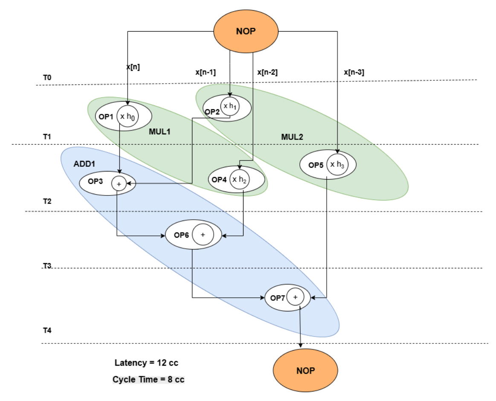
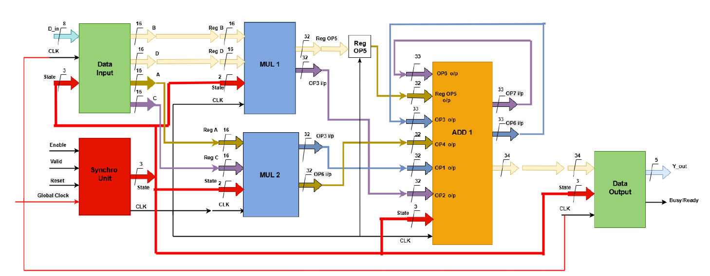
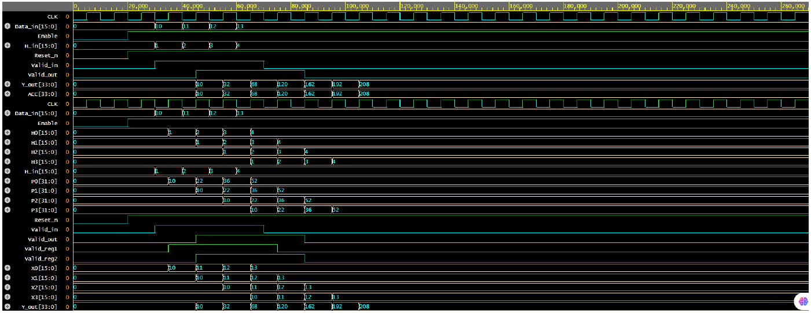

# 4‑Tap Low‑Pass FIR Filter (VHDL)

Design, analysis, and hardware implementation of a **4‑tap low‑pass FIR filter** with a 5 MHz cutoff. 
This repo organizes the full project for portfolios and job applications, with clean source code, a runnable testbench, and the original report.

> **Highlights**
> - Pareto‑optimal architecture (Variant **ID 122**): **1 adder**, **2 multipliers**, **PLL = 100 MHz**
> - Execution time (**Texe**) ≈ **40.12 µs** for 501 samples (meets < 50.1 µs)
> - Power consumption ≈ **4.48 W** (< 10 W constraint)
> - 16‑bit inputs/coeffs; **34‑bit** accumulated output
> - Modular VHDL‑2019 code + testbench

---

## Architecture Selection
Explored multiple architecture variants with timing & power trade-offs.  
Chosen **ID 122** satisfies both constraints.




## System Architecture


---

## Simulation Result
Example with inputs = 10, 11, 12, 13 and coeffs = 1, 2, 3, 4.  
Expected first valid output:  
`y = 10*1 + 11*2 + 12*3 + 13*4 = 120`



---
## Repository Structure
```
├── src/
│   └── vhdl/
│       ├── FIR_Filter_Top.vhd
│       ├── Data_Input.vhd
│       ├── Coeff_Shift_Register.vhd
│       ├── MUL1.vhd
│       ├── MUL2.vhd
│       ├── ADD1.vhd
│       ├── Data_Output.vhd
│       └── Synchro_Unit.vhd
├── sim/
│   ├── FIR_Top_TB.vhd
│   └── run_ghdl.sh
│   
├── assets/           # diagrams / waveforms (add images here)
├── .gitignore
├── LICENSE
└── README.md
```

## What this project demonstrates
- DSP design: 4‑tap FIR `y[n] = Σ h[i]·x[n−i]` (i=0..3)
- Architecture exploration: max/min resources, **critical variants**, **border variants**
- Selection of Pareto‑optimal **ID 122** via timing & power constraints
- HDL implementation with **shift‑register** data/coeff handling, **pipelined valid** signaling
- Verification with a self‑contained **testbench**

## Quick Start (GHDL)
Requirements: [GHDL](https://ghdl.github.io/ghdl/), [GTKWave](http://gtkwave.sourceforge.net/) (optional)

```bash
cd sim
bash run_ghdl.sh
```
This will:
- analyze all VHDL files (VHDL‑2008/2019 compatible),
- elaborate the `FIR_Top_TB` testbench,
- run simulation and dump a `wave.ghw` waveform (open in GTKWave).

## Testbench stimulus (example)
The testbench pushes four samples (10, 11, 12, 13) and coefficients (1, 2, 3, 4).
Expected first correct output:  
`y = 10*1 + 11*2 + 12*3 + 13*4 = 120`

## Notes
- Code targets generic FPGA and standard simulators. Timing numbers are analytic from the report; actual post‑synthesis timing depends on the device and toolchain.
- For classroom submission, include `docs/Project_Report.pdf`. For portfolio, link this repo and optionally post diagrams under `/assets`.


## ✍️ Author

- Amrita Sinha Roy
If you use this work, please cite the project/report accordingly.
---

## 🧾 License


MIT --- see [LICENSE](./LICENSE)


